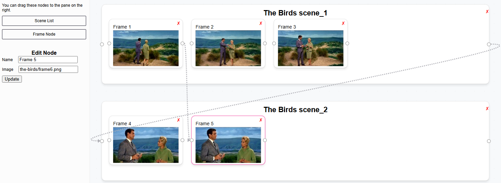

# Media Storyboard Node Diagram Prototype

I created this prototype using React Flow as a proof of concept. I intend to integrate it as a
component in a larger media storyboard project. This is why group nodes are called "scene lists"
and smaller nodes are called "frames". The idea is for a media scene to be a group of frames
that typically run one after the other (represented as a horizontal list). However, edges will
connect frames together when there are choices to be made by the user and it will then jump
to a different scene. It can be like a choose-your-own-adventure game.

It was a challenge to align the frame nodes in a horizontal list and be able to
rearrange them by dragging them over. React Flow was built to position nodes in absolute positions.
React Flow works with other [layouts](https://reactflow.dev/examples/layout/horizontal),
but those don't work the way I want.

Before this one, I created two other projects that didn't
work out. Both of them had a horizontal scrolling overflow list. I wanted to be able to limit the
width of the scene lists and allow the user to just scroll through the list. It didn't work out
because the positioning of handles and edges by React Flow got weird when I used that kind of
layout and style. When I tried to connect nodes together with edges, it would connect to the
wrong node and there was no way to fix it. So, with this project, I just expand the scene list
when more frames are added.

### Example using stills from the movie The Birds (1963)
[](https://vintillect.com/storyboard/)

## How I created it.

React Flow has a helpful [Vite React Flow Template](https://reactflow.dev/learn) to install and get started.

```bash
npx degit xyflow/vite-react-flow-template your-app-name
```

Instead of relying upon React's built in state manager and Redux, I decided to use [Redux Toolkit](https://redux-toolkit.js.org/) which as [Immer built in](https://redux-toolkit.js.org/usage/immer-reducers). This allowed me to make my reducers much more simplified as it appears that it mutates the state.
In my opinion, "reducer" is a horrible, misleading name for these kinds of functions. They don't reduce anything.

```bash
npm install @reduxjs/toolkit
```

## Groups / Sub Flows

I didn't use their Pro Plan (though I intend to do so in the future to support their awesome work), but I created my own [dynamic grouping](https://reactflow.dev/examples/nodes/dynamic-grouping) of nodes.
